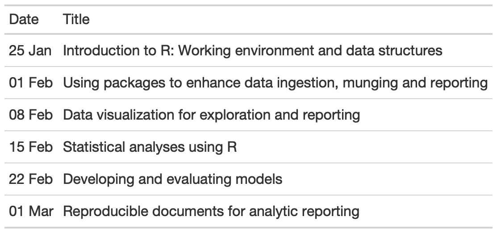

```{r, include=FALSE, child = '../css/setup.Rmd'}

```

---
class: middle,center,inverse

# About this class

---

## Learning Objectives

- Run R and RStudio, making use of inherent R features
- Find and make use of the extensive packages (R add-ons) available for analyzing biological and other forms of data
- Load, manipulate, and combine data to make it amenable to further analyses
- Visualize data with extensive graphics capabilities of R (including ggplot)
- Use R to run statistical models and hypothesis tests and report results conforming to standards expected in scientific journals
- Write reports using the powerful `rmarkdown` package and its derivatives

---

## Plan

```{r, echo=F, message=F, warning=F,out.width="70%"}
library(lubridate)
library(gt)
start_date = as_date('2021-01-25')
class_dates = start_date + (0:5)*days(7)
outline <- tibble(Title = c(
  "Introduction to R: Working environment and data structures",
  "Using packages to enhance data ingestion, munging and reporting",
  "Data visualization for exploration and reporting",
  "Statistical analyses using R",
  "Developing and evaluating models",
  "Reproducible documents for analytic reporting"
)) %>% 
  mutate(
         Date = format(class_dates, '%d %b')) %>% 
  select(Date, everything())

gt(outline) %>% 
  gtsave('contents.png')
# 
```


---

## Teaching materials

1. The primary materials for this class will be available at https://www.araastat.com/AZ_PracticalR (Link in Teams)
1. Tutorials from RStudio's [Primers](https://rstudio.cloud/learn/primers) will be assigned for practice
1. The [Resources](../../resources.html) page has various online free resources, including several books and cheatsheets. Some readings may be assigned from these resources

---

## Communication

+ Primarily via Teams using the class channel
+ Questions and comments for each week should be kept within that week's chat 
+ If you have questions/comments, please post on Teams rather than sending me an e-mail or a direct message. This is so we can all participate, help each other, and benefit from all the questions and answers

---
class: middle,center,inverse

# Why use R?

---

class: middle, center


---

# What does R look like?

.left-column30[
+ A .heatinline[scripting] language
  - Provide instructions to the computer
  - in a .saltinline[structured] manner
  - to do statistical analysis
]
.right-column30[

```{r ex, echo=T, eval=F}
# Determining frequencies of breast cancer subtypes

type_frequencies <- 
  breast_cancer %>% 
    mutate(luminalA = ifelse(ER == '+' & PR == '+' & HER2 == '-', 1, 0),
         luminalB = ifelse(ER == '+' & PR == '-' & HER2 == '+', 1, 0),
         her2 = ifelse(ER == '-' & PR == '-' & HER2 == '+', 1, 0),
         basal = ifelse(ER == '-' & PR == '-' & HER2 == '-', 1, 0)) %>% 
    mutate(type = case_when(
      luminalA == 1 ~ "Luminal A",
      luminalB == 1 ~ "Luminal B",
      her2 == 1 ~ "HER2",
      basal == 1 ~ "Basal",
      TRUE ~ NA)) %>%
    count(type)
```
]

---

# What does R look like?

.left-column30[
+ Start with a data set
]
.right-column30[

```{r ex1, eval=F}
# Determining frequencies of breast cancer subtypes

type_frequencies <- 
  breast_cancer %>% #<<
    mutate(luminalA = ifelse(ER == '+' & PR == '+' & HER2 == '-', 1, 0),
         luminalB = ifelse(ER == '+' & PR == '-' & HER2 == '+', 1, 0),
         her2 = ifelse(ER == '-' & PR == '-' & HER2 == '+', 1, 0),
         basal = ifelse(ER == '-' & PR == '-' & HER2 == '-', 1, 0)) %>% 
    mutate(type = case_when(
      luminalA == 1 ~ "Luminal A",
      luminalB == 1 ~ "Luminal B",
      her2 == 1 ~ "HER2",
      basal == 1 ~ "Basal",
      TRUE ~ NA)) %>%
    count(type)
```
]

---

# What does R look like?

.left-column30[
+ Start with a data set
+ Create new variables from old variables
]
.right-column30[

```{r ex2, eval=F}
# Determining frequencies of breast cancer subtypes

type_frequencies <- 
  breast_cancer %>% 
    mutate(luminalA = ifelse(ER == '+' & PR == '+' & HER2 == '-', 1, 0), #<<
         luminalB = ifelse(ER == '+' & PR == '-' & HER2 == '+', 1, 0), #<<
         her2 = ifelse(ER == '-' & PR == '-' & HER2 == '+', 1, 0), #<<
         basal = ifelse(ER == '-' & PR == '-' & HER2 == '-', 1, 0)) %>% #<<
    mutate(type = case_when(
      luminalA == 1 ~ "Luminal A",
      luminalB == 1 ~ "Luminal B",
      her2 == 1 ~ "HER2",
      basal == 1 ~ "Basal",
      TRUE ~ NA)) %>%
    count(type)
```
]

---

# What does R look like?

.left-column30[
+ Start with a data set
+ Create new variables from old variables
+ Deal with missing values
]
.right-column30[

```{r ex3, eval=F}
# Determining frequencies of breast cancer subtypes

type_frequencies <- 
  breast_cancer %>% 
    mutate(luminalA = ifelse(ER == '+' & PR == '+' & HER2 == '-', 1, 0), 
         luminalB = ifelse(ER == '+' & PR == '-' & HER2 == '+', 1, 0), 
         her2 = ifelse(ER == '-' & PR == '-' & HER2 == '+', 1, 0), 
         basal = ifelse(ER == '-' & PR == '-' & HER2 == '-', 1, 0)) %>% 
    mutate(type = case_when(
      luminalA == 1 ~ "Luminal A",
      luminalB == 1 ~ "Luminal B",
      her2 == 1 ~ "HER2",
      basal == 1 ~ "Basal",
      TRUE ~ NA)) %>% #<<
    count(type)
```
]

---

# What does R look like?

.left-column30[
+ Start with a data set
+ Create new variables from old variables
+ Deal with missing values
+ Find the frequencies
]
.right-column30[

```{r ex4, eval=F}
# Determining frequencies of breast cancer subtypes

type_frequencies <- 
  breast_cancer %>% 
    mutate(luminalA = ifelse(ER == '+' & PR == '+' & HER2 == '-', 1, 0), 
         luminalB = ifelse(ER == '+' & PR == '-' & HER2 == '+', 1, 0), 
         her2 = ifelse(ER == '-' & PR == '-' & HER2 == '+', 1, 0), 
         basal = ifelse(ER == '-' & PR == '-' & HER2 == '-', 1, 0)) %>% 
    mutate(type = case_when(
      luminalA == 1 ~ "Luminal A",
      luminalB == 1 ~ "Luminal B",
      her2 == 1 ~ "HER2",
      basal == 1 ~ "Basal",
      TRUE ~ NA)) %>%
    count(type) #<<
```
]

---

# What does R look like?

.left-column30[
+ Start with a data set
+ Create new variables from old variables
+ Deal with missing values
+ Find the frequencies
+ Save the results in an **object**
]
.right-column30[

```{r ex41, eval=F}
# Determining frequencies of breast cancer subtypes

type_frequencies <- #<<
  breast_cancer %>% 
    mutate(luminalA = ifelse(ER == '+' & PR == '+' & HER2 == '-', 1, 0), 
         luminalB = ifelse(ER == '+' & PR == '-' & HER2 == '+', 1, 0), 
         her2 = ifelse(ER == '-' & PR == '-' & HER2 == '+', 1, 0), 
         basal = ifelse(ER == '-' & PR == '-' & HER2 == '-', 1, 0)) %>% 
    mutate(type = case_when(
      luminalA == 1 ~ "Luminal A",
      luminalB == 1 ~ "Luminal B",
      her2 == 1 ~ "HER2",
      basal == 1 ~ "Basal",
      TRUE ~ NA)) %>%
    count(type) 
```
]

---

# What does R look like?

.left-column30[
+ Start with a data set
+ Create new variables from old variables
+ Deal with missing values
+ Find the frequencies
+ Save the results in an **object**
+ .heatinline[Comment on what you're doing]
]
.right-column30[

```{r ex5, eval=F}
# Determining frequencies of breast cancer subtypes #<<

type_frequencies <- 
  breast_cancer %>% 
    mutate(luminalA = ifelse(ER == '+' & PR == '+' & HER2 == '-', 1, 0), 
         luminalB = ifelse(ER == '+' & PR == '-' & HER2 == '+', 1, 0), 
         her2 = ifelse(ER == '-' & PR == '-' & HER2 == '+', 1, 0), 
         basal = ifelse(ER == '-' & PR == '-' & HER2 == '-', 1, 0)) %>% 
    mutate(type = case_when(
      luminalA == 1 ~ "Luminal A",
      luminalB == 1 ~ "Luminal B",
      her2 == 1 ~ "HER2",
      basal == 1 ~ "Basal",
      TRUE ~ NA)) %>%
    count(type) 
```
]

--

.center[This is an example of a .heatinline[pipeline] in R. We'll develop different aspects of this
progressively throughout the course]

---
class: middle,center,inverse

# But, I already know Excel/Graphpad/Prism/SPSS!!


---
# Why use a scripting language for analysis?

.pull-left[
.large[Pros:]

1. .heatinline[Have to think]
1. Reproducible (custom) workflows
1. Much less error-prone
1. Much lower costs to repeat analyses, or as you learn more
1. Easily leverage work of smarter developers
1. Easier to work with larger datasets (more than size of screen)
]
.pull-right[
.large[Cons:]

1. Have to type
1. Have to know the language
1. Higher initial startup cost
1. .heatinline[Have to think]
]

---

# Why use a scripting language for analysis?

.pull-left[
.large[Pros:]

1. **Have to think**
1. Reproducible (custom) workflows
1. Much less error-prone
1. Much lower costs to repeat analyses, or as you learn more
1. Easily leverage work of smarter developers
1. Easier to work with larger datasets (more than size of screen)
]
.pull-right[
+ You're giving instructions to a fast but stupid machine
+ This machine will do .heatinline[**exactly**] what you tell it
+ The machine is capable of amazing things
+ Can't just _menu-mine_ and try things that __seem__ to be what you want

#### With great power comes great responsibility

#### But also great benefits

]

---

# Why use a scripting language for analysis?

.pull-left[
.large[Pros:]

1. Have to think
1. Reproducible (custom) workflows
1. **Much less error-prone**
1. Much lower costs to repeat analyses, or as you learn more
1. Easily leverage work of smarter developers
1. Easier to work with larger datasets (more than size of screen)
]
.pull-right[
+ If your code is not right, it won't run
  - Can be frustrating
  - But if it runs you're much more confident
+ If you screw up in Excel
  - almost impossible to recover
+ You have much more control over what you're doing
]

---

# Why use a scripting language for analysis?

.pull-left[
.large[Pros:]

1. Have to think
1. Reproducible (custom) workflows
1. Much less error-prone
1. Much lower costs to repeat analyses, or as you learn more
1. **Easily leverage work of smarter developers**
1. Easier to work with larger datasets (more than size of screen)
]
.pull-right[
+ Can use _modules_ or _packages_ developed by others
  - `tidyverse`, `Seurat`, `ggplot2`
+ Can "steal" code from others (provided license allows)
]

---

# Why use a scripting language for analysis?

.pull-left[
.large[Pros:]

1. Have to think
1. Reproducible (custom) workflows
1. Much less error-prone
1. Much lower costs to repeat analyses, or as you learn more
1. Easily leverage work of smarter developers
1. **Easier to work with larger datasets (more than size of screen)**
]
.pull-right[
Good luck working with

+ GWAS data
+ fMRI data
+ Stocks and bonds data
+ Sports data
+ Many more ...

in a unified environment  

Learn once, use everywhere
]

---

# Why use `r fa('r-project', fill='steelblue')`?

+ Specializes in statistics and data visualization
+ Flexible
  - ~~_If you can do it_~~ __How you can do it__
+ Large ecosystem
  - Over 16,000 packages, 1500+ dedicated to bioinformatics
  - Can read from most sources of data
  - Generic and specialized analyses
+ Fantastic community
  - Twitter, StackOverflow, blogosphere, conferences, online books

---

# Why use `r fa('r-project', fill='steelblue')`?

R is a very high-quality product that is accepted and used widely in 
government agencies, corporations and universities worldwide

- Standard data analytic software in bioinformatics, behavioral health and many aspects of quantitative finance
- Increasingly used in pharma, economics, political science and engineering

--

R is open-source, in that anyone can see the actual code and validate the 
computations directly

---

# Why use `r fa('r-project', fill='steelblue')`?

- R has a well-deserved reputation for being a great data visualization 
tool, with users being able to create complex, customizable graphs with relative 
ease
- As a scripting language, it allows the same workflows to be coded and re-used.
- You can set up workflows to validate data, in terms of data quality and missingness, 
which avoids visual inspection which can be time-consuming and mistake-prone. 
- R can handle large datasets, and can work with multiple datasets at the same time

---

# Why use `r fa('r-project', fill='steelblue')`?

Specialized packages available for many domains

- Bioinformatics
- Econometrics
- Maps and spatial analytics 
- Text mining and Natural Language Processing

The [CRAN Task Views](https://cran.r-project.org/web/views/) 
provide curated lists of packages based on different domains

The [Bioconductor Project](https://www.bioconductor.org) is THE source for bioinformatics packages in R. It is the gold standard for many bioinformatic workflows


---

# Things `r fa('r-project', fill='steelblue')` is not (in this class)

--

- The 18th letter of the English alphabet

--

- A magic incantation that will produce an analysis

--

- Just something the cool kids are doing

--

- Point-and-click, automatic, WYSIWYG (What you see is what you get)
    - So it's not Excel, SPSS, Prism, GraphPad
    - It's much more!!!

---

# A note on Excel `r fa('file-excel', fill='steelblue')`

.pull-left[
   

Excel is omnipresent, so it becomes the default data medium

It is great for many things, including _quick-and-dirty_ analyses

.heatinline[It can be error-prone]

It needs to be backed up

It has size limitations

Takes a lot of effort to do complex analyses
]

--

.pull-right[
+ No way to reproduce analyses without macros
+ No way to document what you are doing
+ Excel has some nasty default behavior
  - Guess what the `MAR1` gene gets recorded as?
+ Very hard to recover from errors
  - Shift of one error (off by one row or column)
  - Google _Duke Potti_ or _Reinhart Rogoff Herndon_
]

---
class: middle,center,inverse

# Using RStudio and organizing projects

---

## RStudio

#### I'll be doing a demo here, but document the main points in the following slides

---

## Open a new script 

.pull-left[
```{r, echo=FALSE}
knitr::include_graphics('../img/NewScript.png')
```
]

.pull-right[
You will start by opening a new script

- This is a blank canvas
- You will write R code (instructions) in this script
- This is just a text editor, so you can copy, paste, edit just as in Notepad
- Good practice is to write code in the script window, then **send** the code to R
]


---

## Run some code

.pull-left[

Write some code, then send it to the console, where R is running

- You can use the button, but
- I prefer you learn the keyboard shortcut
- Ctrl/Cmd + Enter sends either
  - current line under cursor
  - highlighted code
]
.pull-right[
]

---
class: middle,center,inverse

# RStudio Projects

---

# RStudio Projects

```{r 10-BestPractice-1,  echo=F, message=F, warning=F}
knitr::include_graphics('../img/project1.png')
# library(magick)
# plt <- image_read(path(path_rel(imgdir),'project1.png'))
# image_scale(plt, "1600")
```

---

## RStudio Projects
```{r 10-BestPractice-2, echo=F, message=F, warning=F}
knitr::include_graphics('../img/project2.png')
# plt <- image_read('../img/project2.png')
# image_scale(plt, "1600")
```

---

## RStudio Projects
```{r 10-BestPractice-3,  echo=F, message=F, warning=F}
knitr::include_graphics('../img/project3.png')
# plt <- image_read('../img/project3.png')
# image_scale(plt, "1600")
```

---

## RStudio Projects
```{r 10-BestPractice-4,  echo=F, message=F, warning=F}
knitr::include_graphics('../img/project4.png')
# plt <- image_read('../img/project4.png')
# image_scale(plt, "1600")
```

---

## RStudio Projects
```{r 10-BestPractice-5,  echo=F, message=F, warning=F}
knitr::include_graphics('../img/project5.png')
# plt <- image_read('../img/project5.png')
# image_scale(plt, "1600")
```

---

## RStudio Projects
```{r 10-BestPractice-6,  echo=F, message=F, warning=F}
knitr::include_graphics('../img/project6.png')
# plt <- image_read('../img/project6.png')
# image_scale(plt, "1600")
```

---

## RStudio Projects
```{r 10-BestPractice-7,  echo=F, message=F, warning=F}
knitr::include_graphics('../img/project7.png')
# plt <- image_read('../img/project7.png')
# image_scale(plt, "1600")
```

---
name: proj1

## RStudio Projects

When you create a Project, the following obvious things happen:

1. RStudio puts you into the right directory/folder
2. Creates a .Rproj file containing project options
    + You can double-click on the .Rproj file to open the project in RStudio
3. Displays the project name in the project toolbar (right top of the window)

---

## RStudio Projects

The following not-so-obvious things happen:

1. A new R session (process) is started
2. The .Rprofile file in the project’s main directory (if any) is sourced by R
3. The .RData file in the project’s main directory is loaded (this can be controlled by an option).
4. The .Rhistory file in the project’s main directory is loaded into the RStudio History pane (and used for Console Up/Down arrow command history).
5. The current working directory is set to the project directory.
6. Previously edited source documents are restored into editor tabs, and
7. Other RStudio settings (e.g. active tabs, splitter positions, etc.) are restored to where they were the last time the project was closed.

---

## RStudio Projects

I use [Projects]() so that:

1. I'm always in the right directory for the project
2. I don't contaminate one project's analysis with another (different sandboxes)
3. I can access different projects quickly
4. I can version control them (Git) easily (topic for beyond this class)
5. I can customize options per project

.footnote[A great reference for git from a R user's perspective is Jenny Bryan's excellent [happygitwithr.com](https://happygitwithr.com/)]
---

## RStudio Projects
```{r 10-BestPractice-8, echo=F}
knitr::include_graphics('../img/project8.png')
# image_scale(plt, "1600")
```

---
class: middle,center,inverse

# Taking notes and putting together reports: R Markdown

---

```{r, child = 'children/rmarkdown.Rmd'}

```

---
class: middle,center,inverse

# Data structures in R

---

```{r, child = 'children/datastructures.Rmd'}

```

---
class: middle,center,inverse

# Functions

---

```{r, eval=F, child='children/functions.Rmd'}

```

---
class: middle,center,inverse

# Naming things

---

```{r, child='children/names.Rmd'}

```

---

layout: false

---
class: middle,center,inverse

# Packages in R

---

```{r, eval=F, child='children/packages2.Rmd'}

```

