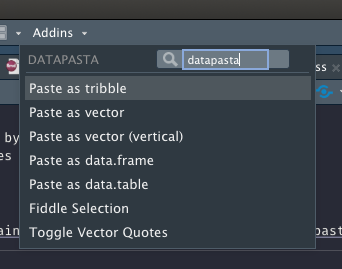
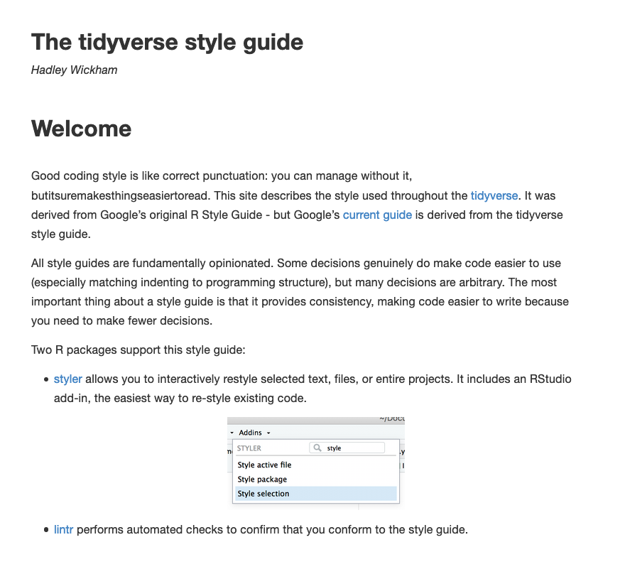
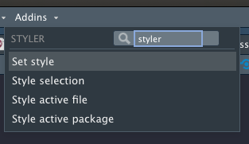

---
class: middle,center,inverse

# Some useful packages

---
## reprex

The [**reprex**](https://reprex.tidyverse.org/) package helps produce *reproducible examples*
It is meant to provide runnable code when asking questions on StackOverflow, Github Issues, or even Slack or e-mail. 

When you ask a question about a problem you're having in R, it's best to provide a 
[minimal reproducible](https://yihui.org/en/2017/09/the-minimal-reprex-paradox/) [example](https://stackoverflow.com/questions/5963269/how-to-make-a-great-r-reproducible-example). This allows you to actually try to identify the problem, and allows a helper to 
reproduce the problem with minimal fuss. 

.pull-left[

]
.pull-right[
- A webinar explaining the **reprex** package ([link](https://rstudio.com/resources/webinars/help-me-help-you-creating-reproducible-examples/))
- [Reprex do's and don'ts](https://reprex.tidyverse.org/articles/reprex-dos-and-donts.html)
- [Magic reprex](https://reprex.tidyverse.org/articles/articles/magic-reprex.html)


]

---

## datapasta

**datapasta** is a really useful package developed by Miles McBain to allow
copy-paste of vectors and tables into R. It provides an RStudio add-in that makes
this process simple

.left-column70[

]
.right-column70[

]

---

## styler

The **styler** package helps to format your R code to meet the tidyverse style guide. It works on both .R and .Rmd files. 

The **styler** package also provides a RStudio add-in that styles a particular file, or all 
files in a directory

.left-column70[

]
.right-column70[

]

---

## plotly

[**plotly** ](https://plotly.com/r/) is a Javascript package for producing interactive
graphs that has a very nice R interface. **plotly** is also available for Python. 

.pull-left[
```{r plotly, eval = F, echo = T}
library(plotly)

fig <- plot_ly(data = iris, 
               x = ~Sepal.Length, 
               y = ~Petal.Length, 
               color = ~Species)

fig

```
]
.pull-right[
```{r, eval=T, echo = F, ref.label="plotly"}
```
]

---

## Interacting with Excel

- **openxlsx** for writing, styling and editing worksheets
- **tidyxl** for reading messy, non-tabular data from Excel into a tidy format (see an example [here](https://webbedfeet.netlify.app/post/tidying-messy-excel-data-tidyxl/))
